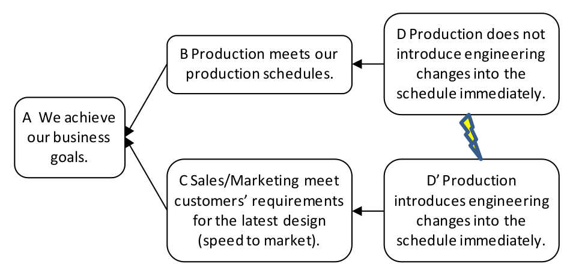

### облако НЖЯ (UDE cloud)

**облако НЖЯ (UDE cloud)** - испаряющееся облако, используемое отдельно (т. е. не как часть полного анализа мыслительных процессов), направленное на устранение одного нежелательного эффекта.

Использование: Облако НЖЯ используется для устранения нежелательных эффектов, отрицательно влияющих на производительность системы, которые существуют в течение определенного периода времени и не поддаются другим попыткам решения. Облака НЖЯ также можно использовать для устранения нежелательных последствий для клиентов.

Иллюстрация: Облако для нежелательного эффекта «У нас слишком много нехватки деталей для сборки» показано ниже:

-   [(A) Мы достигаем наших бизнес-целей. ]{.c1}
-   [(B) Производство соответствует нашим производственным графикам.]{.c1}
-   [(D) Производство не вносит инженерные изменения в график сразу]{.c1}
-   [(D') Производство вносит инженерные изменения в график немедленно.]{.c1}
-   [(C) Отдел продаж/маркетинга отвечает требованиям клиентов в отношении новейшего дизайна (скорость выхода на рынок) ]{.c1}

\[

Синоним: [[облако с одним НЖЯ]].

#мп

*Примечание АВ:,697 страница хендбука*

*Алгоритм построения из хендбука 697 страница:*

\[B\]-\>\[D\]-\>\[C\]-\>\[D′\]-\>\[A\]

*(B): Почему это НЖЯ нежелательно? Какую важную потребность системы она ставит под угрозу*

*или подвергать опасности?*

*(D): Какие действия следует предпринять, чтобы удовлетворить находящуюся под угрозой потребность в B?*

*(C): Какая еще важная потребность мешает вам всегда совершать действие D?*

*(D′): Какие действия вы предпринимаете, чтобы удовлетворить потребность в C?*

*(A): Какова общая цель, достигнутая с помощью B и C?*

Синоним: [[UDE cloud]].

#translated
