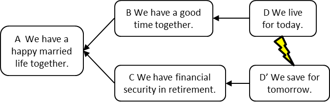

### оговорка дополнительной причины (additional cause reservation, проверка наличия альтернативной причины)

**оговорка дополнительной причины (additional cause reservation, проверка наличия альтернативной причины)** - Оговорка уровня III в категориях законных оговорок [(Критерий проверки логических построений, "достаточность приведенной причины")]{.c3}, которое используется лицом, внимательно изучающим логическую схему, [основанную на достаточности]{.c3}**,** чтобы задать вопрос, является ли указанная причина (причины) достаточными для полного учета заявленного следствия. Обоснованная дополнительная причина будет иметь значительное влияние на заявленный эффект.

Пример: Диаграмма слева внизу читается. Если 10 У моей машины очень низкий расход бензина, то 20 Я предпочитаю ездить на автобусе на работу. Исследователь может использовать дополнительную оговорку о причине, чтобы предположить, что 15 Я люблю читать по дороге на работу, также может быть законной причиной для предпочтения сесть на автобус. Диаграмма справа выглядит следующим образом: Если 10 У моей машины очень низкий расход топлива, то 20 я предпочитаю ездить на автобусе на работу. Если 15 я люблю читать по дороге на работу, то 20 я предпочитаю ехать на работу на автобусе. Две независимые причины описываются как магнитный «и»-соединитель.

Перспектива: легитимная дополнительная причина ужесточит логику, лежащую в основе наблюдаемого эффекта, и более полно объяснить его величину. [Ни одна из причин сама по себе не может полностью объяснить величину или степень эффекта.]{.c3} Исследователь может предложить дополнительную причину, и докладчик диаграммы может принять ее, если ее влияние будет значительным. Оговорка дополнительных причин важно, потому что устранение только одной из нескольких независимых причин не устранит эффект полностью.

См.: [[Категории законных оговорок]], [[магнитный  «и»-соединитель]], [[проверка]], [[логика основанная на достаточности]].

#мп

#кплп

*Примечание АВ: Нужно задавать вопросы: А точно ли достаточно одной причины для этого следствия? Есть ли что-то еще?   См. Детмер,  74 стр. Критерий проверки логических построений*

[См. перевод ]{.c3} [ [TOCPeople](https://www.google.com/url?q=https://tocpeople.com/terminy/proverka-nalichiya-alternativnoj-prichiny/&sa=D&source=editors&ust=1630257389795000&usg=AOvVaw3Z0HU6RMbQ52jkxCdTm0Rz){.c18} ]{.c8 .c3}

#translated
