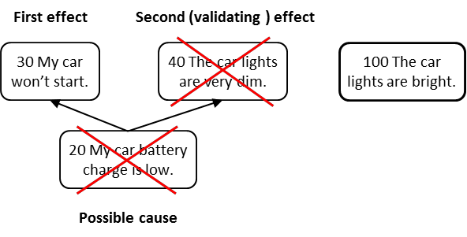

### оговорка о прогнозируемом эффекте (predicted effect reservation)

**оговорка о прогнозируемом эффекте (predicted effect reservation)**- оговорка уровня III в категории законных оговорок (КПЛП), которая используется для оспаривания либо существования объекта, либо существования причинно-следственной связи на основании отсутствия неизбежных последствий, которые должны были бы иметь место, если бы объект или предполагаемая причинно-следственная связь действительно существовала.

Использование: Оговорка о прогнозируемом эффекте может использоваться для доказательства или опровержения существования объекта или причинно-следственной связи, которую очень трудно, а возможно, даже невозможно доказать прямым наблюдением. Существование прогнозируемого эффекта полезно, когда для эффекта выявляется гипотетическая причина, и причина не может быть доказана прямым наблюдением. Однако для того, чтобы гипотетическая причина существовала, должно присутствовать какое-то другое следствие. Если прогнозируемый эффект присутствует, это подтверждает существование предполагаемой причины.

Иллюстрация: Существующий эффект равен (30) Моя машина не заводится. Предполагаемая причина: (20) Низкий уровень заряда автомобильного аккумулятора. Прогнозируемый эффект от низкого заряда батареи: (40). Фары автомобиля очень тусклые. Если проверка фар показывает, что (100) Фары автомобиля яркие, значит заряд автомобильного аккумулятора не должен быть низким. И наоборот, если бы свет действительно был очень тусклым, то было бы подтверждено существование причины, заключающейся в низком заряде автомобильного аккумулятора.

См.: [[категории законных оговорок]], [[причинно-следственная связь]], [[сущность]], [[исследование]].

#мп

#кплп

*Примечание ИА:  Это нужно делать, если других факторов проверки не остается в случае научения на одном событии.  Подробнее в статье "Белые страницы для расширения Свода Знаний (BOK -- Body Of Knowledge) ТОС". Автор Эли Шрагенхайм.*

*Перевод Дмитрия Егорова  * *https://egorovde.ru/archives/4402*

*Из статьи: Если причина явно не видна, то делается "предсказание" (предположение) о наличии причины*

*Из статьи: "Исторически Эли Голдратт определил понятие «следствие-причина-следствие» как ключевой базовый инструмент для размышления и проверки причинно-следственных связей в реальности.*

*Понятие относятся к явлению в реальности, в отношении которого нам интересна вызвавшая его причина. Мы предполагаем, что «следствие» было вызвано «причиной», или несколькими одновременно возникшими причинами, которые объясняют существование следствия в реальности. Однако, не ясно, действительно ли существует эта умозрительная «причина» в нашей*

*реальности. Чтобы проверить существование «причины» в реальности, делается предсказание о существовании другого следствия и, если его удается обнаружить, то это и является подтверждением валидности причины. Это подтверждение с помощью другого следствия было ключевым фактором в идее Голдратта о применении научного подхода к менеджменту.*

*Однако, практические трудности в обеспечении каждой стрелки в дереве, подтверждающим следствием, заставило Голдратта перестать требовать использования такого рода подтверждения при обычном использовании Мыслительных процессов."*

Синоним: [[predicted effect reservation]].

#translated
