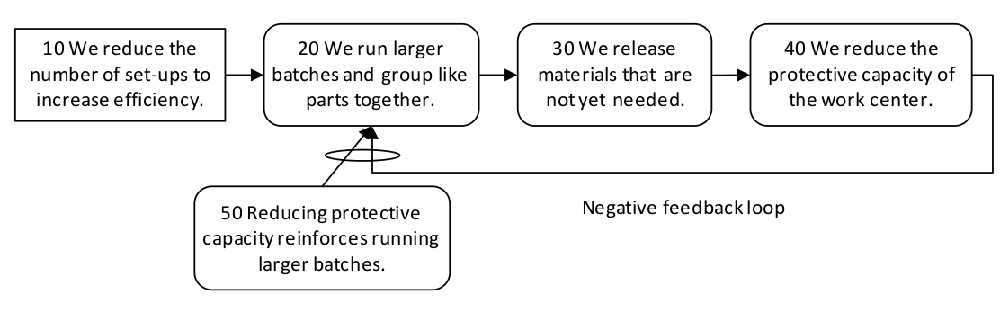

### петля обратной связи (feedback loop)

**петля обратной связи (feedback loop)** - набор логических причинно-следственных связей, которые связаны таким образом, что создают либо возрастающее (положительное), либо убывающее (отрицательное) состояние или поведение в системе.

Использование: приведенное выше определение и использование термина «обратная связь» в ТОС отличается от определения в большинстве других методологий систем, таких как системная динамика. В этих других системных методах положительная обратная связь описывает серию самоусиливающихся эффектов, а отрицательная обратная связь описывает самокорректирующийся или уравновешивающий эффект. В отличие от этого, TOC определяет обратную связь всегда как подкрепляющую обратную связь, положительную или отрицательную, в зависимости от исходной ситуации. В TOC отрицательные усиливающие петли присутствуют в системе, проблемы которой усугубляются, тогда как положительные усиливающие петли активны в хорошо работающей системе, то есть постоянно улучшаются. Как правило, обратная связь включает как передачу, так и возврат информации. Поскольку петли обратной связи существуют во всех реальных системах, важно активно идентифицировать и записывать их в любых диаграммах текущей и будущей реальности как для правильной диагностики, так и для использования для улучшения. Сущности в петле обратной связи - хорошие кандидаты для получения очков воздействия.

Иллюстрация: приведенный ниже пример представляет собой цикл отрицательной обратной связи.

Если 10 «Мы уменьшаем количество настроек для повышения эффективности»,

то 20 «Мы запускаем большие партии и группируем похожие детали вместе».

Если 20 «Мы запускаем большие партии и группируем похожие части вместе»,

то 30 «Мы выпускаем материалы, которые еще не нужны».

И если 30 «Мы отпускаем материалы, которые еще не нужны»,

то 40 ««Снижаем защитную способность рабочего места».

Причинно-следственная связь возвращается с 40 до 20, потому что снижение защитной способности усиливает выполнение больших партий.

Синоним: [[усиливающая петля]].

См.: [[причинно-следственная связь]], [[дерево текущей реальности]], [[дерево будущей реальности]], [[точка воздействия]], [[петля отрицательной обратной связи]], [[петля положительной обратной связи]].

#мп

Синоним: [[feedback loop]].

#translated
