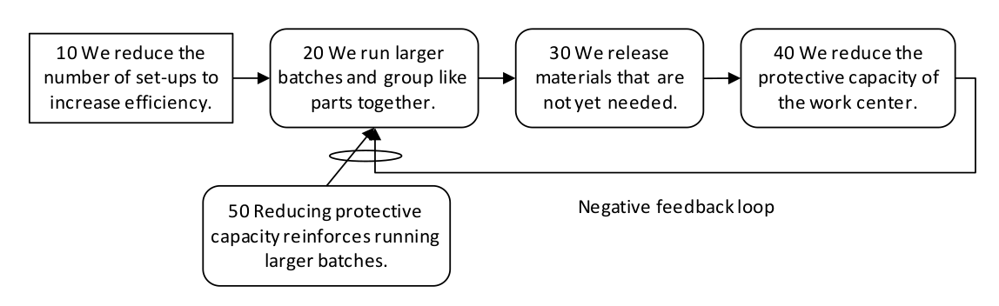

### петля отрицательной обратной связи (negative feedback loop)

**петля отрицательной обратной связи (negative feedback loop)** -  набор логических причинно-следственных связей, которые связаны таким образом, что вызывают уменьшающееся (отрицательное) состояние или поведение в системе.

Использование: петля отрицательной обратной связи всегда является усиливающей обратной связью и присутствует в системе, имеющей проблемы, которые ухудшаются, неуклонно ухудшаются. В общем, обратная связь включает как передачу, так и возврат информации. Поскольку петли обратной связи существуют во всех реальных системах, важно активно выявлять и записывать их в любом дереве текущей реальности как для правильной диагностики, так и для нарушения причинно-следственной связи в ряде мест, чтобы обеспечить улучшение будущего дерева реальности. Объекты в петле обратной связи являются хорошими кандидатами на точки воздействия.

*(схема)*

-   [10 Мы сокращаем количество наладок для повышения эффективности]{.c3}
-   [20 Мы запускаем большие партии и группируем одинаковые детали вместе]{.c3}
-   [30 Мы выпускаем материалы, которые еще не нужны]{.c3}
-   [40 Мы снижаем защитную способность рабочего центра. ]{.c3}
-   [50 Уменьшение защитной емкости контура усиливает работу с большими партиями.]{.c3}

Иллюстрация:

-   [Если 10 Мы сокращаем количество наладок для повышения эффективности,]{.c1}
-   [то 20 Мы запускаем большие партии и группируем одинаковые детали вместе.]{.c1}
-   [Если 20 Мы запускаем большие партии и группируем одинаковые детали, ]{.c1}
-   [то 30 Мы выпускаем материалы, которые еще не нужны. ]{.c1}
-   [И если 30 Мы выпускаем материалы, которые еще не нужны, ]{.c1}
-   [то 40 Мы снижаем защитную способность рабочего центра.]{.c1}

Причинно-следственная связь возвращается с 40 до 20, потому что снижение защитной способности усиливает работу с большими партиями.

Синоним: [[усиливающая петля]].

См.: [[причина-следствие]], [[дерево текущей реальности]], [[петля обратной связи]], [[дерево будущей реальности]], [[точка рычага]], [[петля положительной обратной связи]].

Синоним: [[negative feedback loop]].

#translated
