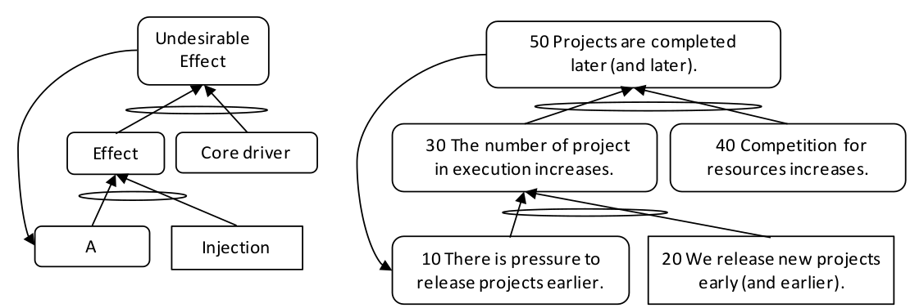

### порочный круг (vicious cycle)

**порочный круг (vicious cycle)** - ситуация, при которой нежелательное следствие (НЖЯ) усиливает свою причину, тем самым делая НЖЯ все более и более нежелательным.

Пример: ситуация, когда проекты опаздывают и организация выпускает новые проекты все раньше и раньше в надежде завершить их к установленному сроку. По мере увеличения числа выполняемых проектов возрастает конкуренция за ресурсы, в результате чего проекты завершаются все позже и позже. Позднее завершение приводит к большему давлению, чтобы выпустить (в работу) последующие проекты еще раньше.

(Ниже перевод схем АВ)

Схема порочного круга

-   [Нежелательный  Эффект . ]{.c1}
-   [Эффект ]{.c1}
-   [Основной драйвер . ]{.c1}
-   [A ]{.c1}
-   [Injection ]{.c1}

Схема примера:

\(50\) Проекты завершены позже (и позже)

\(30\) Количество выполняющихся проектов увеличивается.

\(40\) Конкуренция за ресурсы увеличиваются

\(10\) Есть давление выпускать (в работу) проекты раньше

\(20\) Мы выпускаем (в работу) новые проекты рано (и раньше).

См.: [[петля обратной связи]], [[усиливающая петля]].

#мп

*Примечание АВ: Если при построении ДТР нашли порочный круг, это хорошо для анализа. Так, как порочный круг объясняет почему ситуация не была решена до сих пор. В (почти) любой устойчивой среде с постоянными нежелательными эффектами есть порочный круг.*

Синоним: [[vicious cycle]].

#translated
