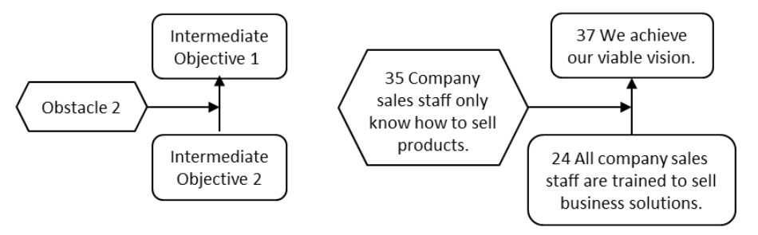

### препятствие (obstacle)

**препятствие (obstacle)** - Что-то, что блокирует или предотвращает желаемое состояние системы, состояние или желаемое действие.

Использование: Препятствия обычно определяются строителями дерева промежуточных целей, поскольку они предвидят возможные блокировки или осложнения при внедрении инъекции для достижения желаемого эффекта или амбициозной цели. Преодоление препятствия требует определения и достижения промежуточной цели.

Иллюстрация:

См.: [[амбициозная цель]], [[желаемый эффект]], [[инъекция]], [[дерево предпосылок]], [[промежуточная цель]], [[мыслительные процессы]].

Синоним: [[obstacle]].

#translated
