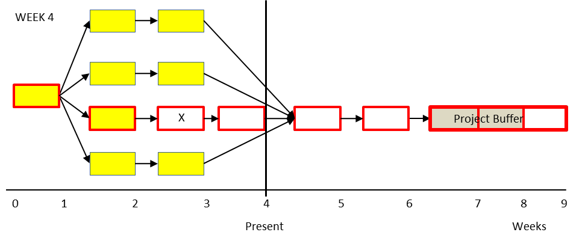

### причинно-следственная связь (cause-effect)

**причинно-следственная связь (cause-effect)** - связь или отношения между объектами, в которых существование одного (или нескольких) объектов (объектов) считается (являются) причиной существования другого объекта (объектов). Причинно-следственная связь устанавливается, если заявленный эффект всегда существует, когда указанная причина (-ы) присутствует (-ы).

Перспектива: в отличие от статистической корреляции причинно-следственная связь представляет собой гораздо более сильную направленную связь между двумя объектами, чем их корреляция или связь друг с другом.

Иллюстрация 1: следующая логическая диаграмма выражена словами: Если 15 Причина A, то 25 Эффект X. Например, Если 15 Идет дождь на моем дворе, то 25 Моя трава намокнет.

Иллюстрация 2: Иногда для создания предполагаемого эффекта необходимы две или три причинных сущности. Вербализуется следующая логическая схема: Если 20 Причина B и 30 Причина C, то 6022

Эффект Y. Например, если 20 Мой огород получает достаточно воды, а 30 Мой сад получает достаточное количество солнечного света, то 60 Мои овощи растут хорошо.

См.: [[эффект]], [[сущность]], [[логика]], [[диаграмма]], [[логический «и»-соединитель]].

#мп

Синоним: [[cause-effect]].

#translated
