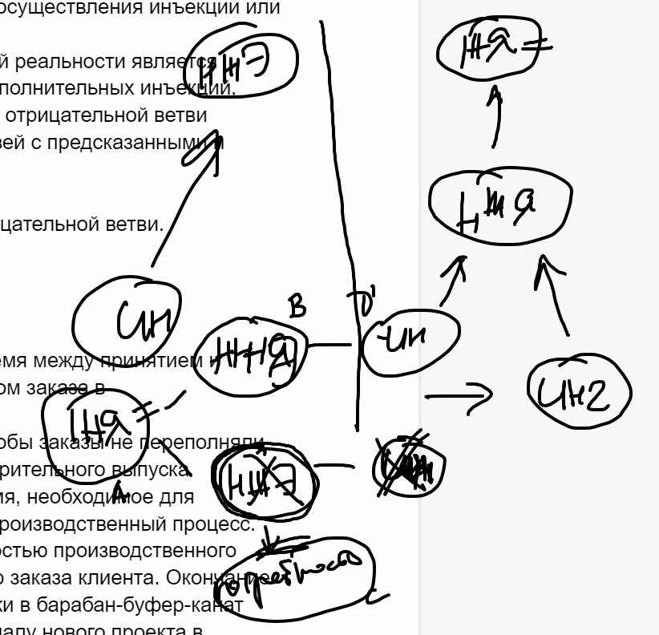

### прогнозируемый нежелательный эффект (predicted undesirable effect)

**прогнозируемый нежелательный эффект (predicted undesirable effect)** - (PUDE) - нежелательный эффект, который ожидается в результате осуществления инъекции или перехода на другую сторону конфликта.

Использование: Одной из основных целей дерева будущей реальности является выявление предсказанных нежелательных эффектов и дополнительных инъекций, необходимых для их предотвращения. Процесс отсечения отрицательной ветви используется для выявления причинно-следственных связей с предсказанными и непредвиденными нежелательными эффектами.

См.: [[дерево будущей реальности]], [[процесс отсечения отрицательной ветви]].

#мп

Примечание АВ: при построении ДТР может появиться нежелательный эффект который слишком дорого отсекать. И может сложиться ситуация при которой единственным решением устранить это НЖЭ отказ от Иньеккции.  В этом случае мы выходим на решение "тучи дилеммы": (D) Делать Инъекцию  для удовлетворения потребности (B) - (устранение НЖЯ) и  (D') НЕ делать Инъекцию для удовлетворения потребности (C) выявленной из НЖЭ. Здесь НЖЭ не может быть использован напрямую в туче дилеммы, он является Предпосылкой к потребности ( C). В результате решения "тучи дилеммы" можно найти "Инъекцию 2" у которой не будет таких нежелательных эффектов.

Синоним: [[predicted undesirable effect]].

#translated
