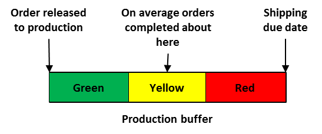

### производственный буфер (production buffer)

**производственный буфер (production buffer)** - В упрощенном термине «барабан-буфер-веревка» либеральная оценка количества времени, необходимого для надежного выполнения рабочего задания.

Использование: Из-за неизбежных сбоев в производственной среде время, необходимое для надежного завершения производства, будет больше, чем просто сумма отдельных производственных этапов. Размер производственного буфера значительно снижает вероятность того, что изменения в системе приведут к пропуску сроков, но не приведут к чрезмерному запасу незавершенного производства. В среднем заказы будут выполнены примерно за половину длины производственного буфера, поэтому заказ попадает в красную зону, если он требует более чем на 33% больше времени, чем среднее время производственного цикла.

Когда заказ размещается с определенной датой выполнения, заказ, возможно, придется ждать отправки в цех либо из-за текущей загрузки цеха, либо из-за того, что с этого момента до

срок выполнения заказа клиента больше, чем производственный буфер. Это время ожидания является предварительным производственным циклом и не является частью производственного буфера.

Перспектива: Упрощенный подход к буферизации «барабан-буфер-веревка» сильно отличается от подхода бережливого канбана. Хотя обе системы являются вытягивающими, канбан включает в себя буферы между каждой последовательной парой рабочих центров, в то время как упрощенный барабан-буфер-веревка связывает веревку от завершения заказа в зависимости от срока выполнения клиентом до выпуска сырья на протяжении всего производственного процесса. Такой подход к производственному буферу значительно сокращает время выполнения заказа и незавершенное производство по сравнению с канбан. Его также можно использовать в очень сложных маршрутах, таких как среда мастерской.

Иллюстрация:

Синоним: [[надежное время производственного цикла]].

См.: [[управление буфером]], [[производство-для-наличия]].

#производство

Синоним: [[production buffer]].

#translated
