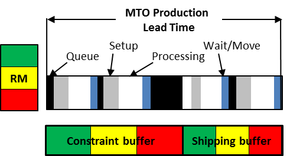
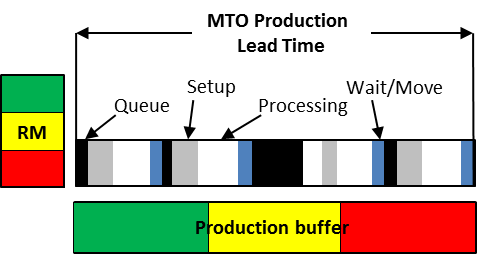

### производство-на-заказ (make-to-order)

**производство-на-заказ (make-to-order)** - (MTO) производственная стратегия, при которой продукт (товар или услуга) производится после размещения заказа клиента.

Использование 1. Когда производственное предприятие имеет внутреннее ограничение, используется планирование барабана-буфера-веревки, а для управления выполнением используется управление буфером. Дата выпуска сырья и предполагаемая дата отгрузки определяются путем помещения процесса ограничения заказа на первую открытую дату в графике ограничений и вычитания графика ограничений для определения выпуска сырья и добавление буфера отгрузки в график ограничений для продукта, чтобы определить дату отгрузки

Иллюстрация 1: MTO с внутренним ограничением:

Использование 2: Когда на производственном предприятии нет внутреннего ограничения, для планирования используется производственный буфер с ресурсом с ограниченными производственными мощностями, который используется для планирования выпуска сырья путем *вычитания половины производственного буфера из запланированной даты загрузки для обработки заказа и путем определения даты отгрузки заказчику путем добавления половины производственного буфера к запланированной дате загрузки.* Сырье с длительным сроком поставки и общие (для всех продуктов) буферы для сырья обычно используются в качестве стратегических буферов для сокращения времени выполнения заказа.

Иллюстрация 2: MTO с рыночным ограничением:

См.: [[производство-для-наличия]], [[инъекции производства-на-заказ]], [[производство-на-склад]].

#производство

Синоним: [[make-to-order]].

#translated
