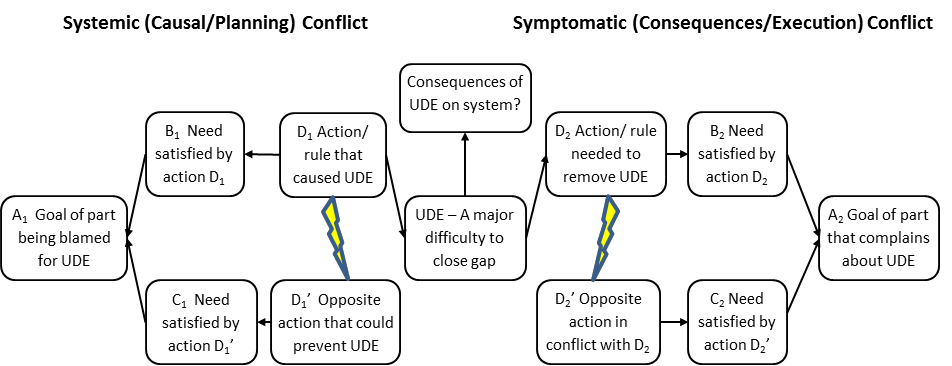

### процесс двойного облака (dual-cloud process)

**процесс двойного облака (dual-cloud process)** - процесс рассмотрения неразрешенных конфликтов, связанных с причинами и последствиями нежелательных эффектов (НЖЭ), отдельно при разработке облаков.

Использование: в процессе двойного облака предполагаемая причина (т.е. конкретные действия или правила) НЖЭ рассматриваются в облаке системного конфликта, чтобы получить \"D\", а последствия НЖЭ (т. е. действия или правила, которые тот, кто имеет дело с НЖЭ, чувствует давление, чтобы иметь дело с НЖЭ) рассматриваются в симптоматическом конфликте. облако. Два облака связаны через НЖЭ, причем D системного облака создает нежелательный эффект, а "D" симптоматического облака - это действие, которое необходимо предпринять для удаления НЖЭ.

Иллюстрация:

См.: [[симптоматический конфликт]], [[системный конфликт]].

#мп

Синоним: [[dual-cloud process]].

#translated
