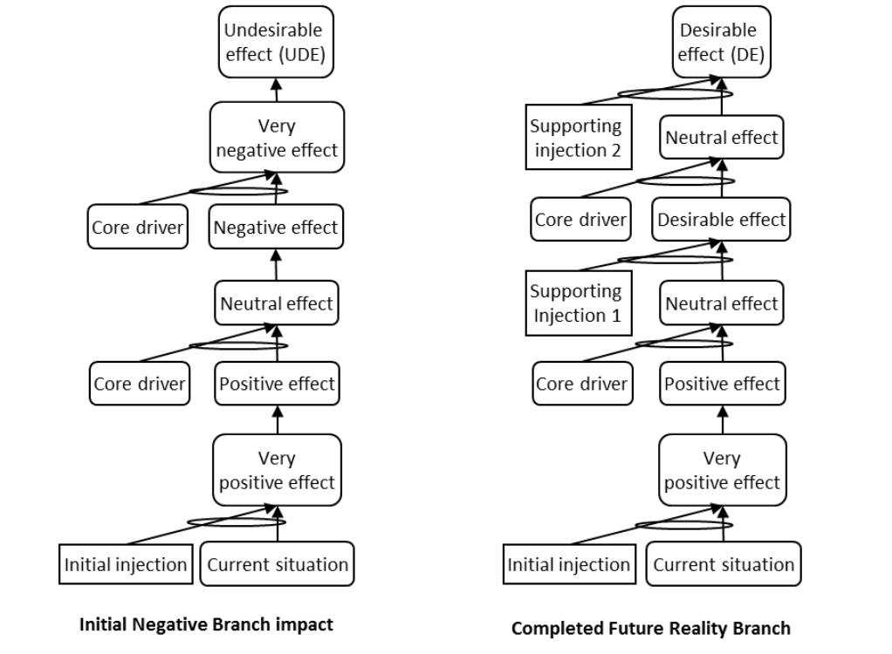

### процесс отсечения негативных ветвей (negative branch reservation process)

**процесс отсечения негативных ветвей (negative branch reservation process)** - метод, который использует логику достаточности, чтобы показать, что реализация предложенной инъекции может привести к одному или нескольким новым нежелательным эффектам.

Использование: процесс отсечения негативной ветви включает в себя создание одной или нескольких ветвей будущей реальности с целью выявления и устранения новых НЖЯ.

Иллюстрация: На рисунке слева показана негативная ветвь. Используя логику «если-то», разработчик пытается устранить нежелательный эффект, разрабатывая дополнительные вспомогательные инъекции. На рисунке справа показано идеальное состояние с желаемыми эффектами.

См.: [[резервирование отрицательной ветви]].

Синоним: [[negative branch reservation process]].

#translated
