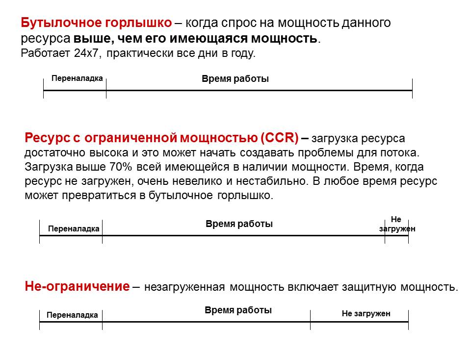

### ресурс с ограниченной пропускной способностью (capacity-constrained resource, CCR)

**ресурс с ограниченной пропускной способностью (capacity-constrained resource, CCR)** - Любой ресурс, который, если его мощность не управляется тщательно, может поставить под угрозу пропускную способность организации.

Иллюстрация: В примере, показанном ниже, производственная линия имеет пять ресурсов (от A до E) с указанными мощностями. Выход ресурса D подвержен достаточным колебаниям, так что, если им не управлять тщательно, объем производства упадет ниже уровня спроса и пропускная способность системы упадет; следовательно, «D» - это ресурс с ограниченной пропускной способностью.

Синоним: [[ресурс с ограниченными возможностями]].

См.: [[ограничение]], [[пропускная способность]].

#производство

#ccpm

[Примечание АВ: Есть коментарий Владимира Речкалова на сайте TOCPeople ]{.c3} [ [https://tocpeople.com/terminy/resurs-s-ogranichennoj-moshhnostyu-rom/](https://www.google.com/url?q=https://tocpeople.com/terminy/resurs-s-ogranichennoj-moshhnostyu-rom/&sa=D&source=editors&ust=1630257389841000&usg=AOvVaw0ClTZV2TGoRit6JU1roBth){.c18} ]{.c8 .c3}

*"*

[1. ]{.c7 .c3} [Ресурс «бутылочное горлышко» (bottleneck resource)]{.c7 .c3 .c4} [ --- любой ресурс, чья мощность меньше либо равна потребности в этом ресурсе.]{.c6 .c3}

[...]{.c3 .c6}

[2. ]{.c7 .c3} [Ресурс с ограниченной мощностью (РОМ) (capacity constrained resource (CCR))]{.c3 .c4 .c7} [ -- любой ресурс, который (если его мощностями управлять некорректно), вероятно, негативно повлияет на проход организации.]{.c6 .c3}

[...]{.c3}

[Однако, бывают РОМ, которые не являются бутылочным горлышком. С одной стороны, у них в среднем есть некоторое время простоя, но иногда очередь на них столь велика, что некоторая часть потребности в нем теряется.]{.c6 .c3}

[И ресурс бутылочное горлышко, и ресурс с ограниченной мощностью -- это всегда ресурсы. И они могут быть ограничением. Т.е. тем, что в настоящее время задерживает поток товаров / услуг / ценности для клиентов и ограничивает проход. Но они не обязательно должны быть ограничением, потому что в системе может быть и другое бутылочное горлышко, загруженное еще сильнее."]{.c6 .c3}

*Примечание АВ:  В один момент времени ресур-ограничение один*

[Примечание АВ:   Ксть комментарий Е.Федурко-Коуэн ]{.c3} [ [https://tocpractice.com/ru/terminy-i-koncepcii-toc/2014/03/05/resurs-ne-ogranichenie-non-ccr/](https://www.google.com/url?q=https://tocpractice.com/ru/terminy-i-koncepcii-toc/2014/03/05/resurs-ne-ogranichenie-non-ccr/&sa=D&source=editors&ust=1630257389843000&usg=AOvVaw00y4CJYjEjry_HrkiQyGjq){.c18} ]{.c3 .c8}

[Незагруженная мощность ресурса включает защитную мощность.]{.c12 .c3}

[С точки зрения мощностей ресурсы разделяются на 3 типа:]{.c12 .c3}

-   [Бутылочное горлышко]{.c3 .c12}
-   [Ресурс с ограниченной мощностью -- РОМ (CCR)]{.c12 .c3}
-   [Ресурс-ограничение]{.c12 .c3}

#translated
