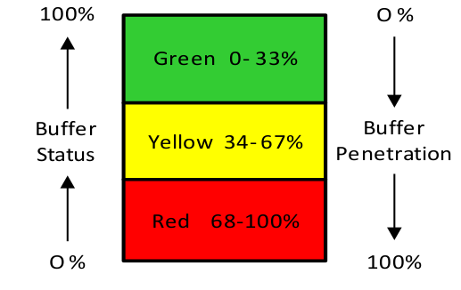

### складской буфер (stock buffer)

**складской буфер (stock buffer)** -  количество материала, хранящегося в точке цепочки поставок, чтобы отделить спрос от предложения. Буферные запасы могут храниться на стадии сырья, на стадиях промежуточного производства (как запасы незавершенного производства) или на стадии готовой продукции. Резервные запасы сокращают время выхода на рынок (заявленное время выполнения заказа) и защищают пропускную способность системы и производительность в срок.

Иллюстрация: Резервный запас для SKU:

Зеленый 0-- 33 %

Желтый 34-- 67 %

Красный 68--100

Перспектива: Буферы запасов используются как в средах производства по наличию, так и в средах производства на заказ для сырья и незавершенного производства. В ASR стратегически пополняемые буферы применяются к стратегическим позициям деталей, буферизуя как восходящие, так и последующие вариации и сокращая время выполнения заказа. Буферы запасов готовой продукции также используются при обеспечении доступности на заводских (центральных), региональных и дистрибьюторских складах и в розничной торговле. Напротив, временные буферы используются для ограничений, сборки, отгрузки и производства в средах изготовления на заказ. Не следует путать буферы запаса и времени.

*Примечание ДП: Actively Synchronized Replenishment  (ASR) - Активно синхронизированное пополнение запасов.*

Синоним: [[штучный буфер]].

См.: [[буфер]], [[буфер сырья]], [[буфер времени]].

#дистрибуция

Синоним: [[stock buffer]].

#translated
