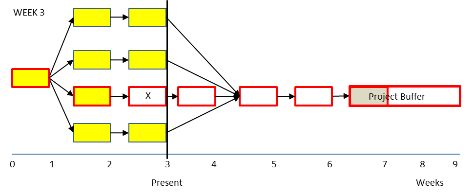

### сложность (complexity)

**сложность (complexity)** - Традиционно, чем больше элементов данных необходимо для описания (частей и взаимозависимостей) системы, тем сложнее система (определяется как сложность деталей). В теории ограничений, как и в точных науках, чем больше степеней свободы у системы, тем сложнее она (определяется как концептуальная сложность).

Пример: Предположим, у вас есть две системы, изображенные как Система A и Система B. Какая система более сложная? Большинство людей скажут «Система B», поскольку в ней гораздо больше точек данных, чем в системе A. Но если четыре точки в системе A независимы, а стрелки в системе B являются причинно-следственными стрелками, тогда система B является более простой системой. В системе A необходимо изменить четыре точки, чтобы изменить систему, но в системе B, поскольку стрелки являются причинно-следственными отношениями, необходимо изменить только одну точку (точка без входящих стрелок), чтобы повлиять на всю систему.

 

См.: [[точка рычага Архимеда]], [[точка рычага]].

#парадигма

[концептуальный «и»-соединитель (conceptual 'and' connector)]{.c12 .c0}

Синоним: [[логический «и»-соединитель]].

#translated
