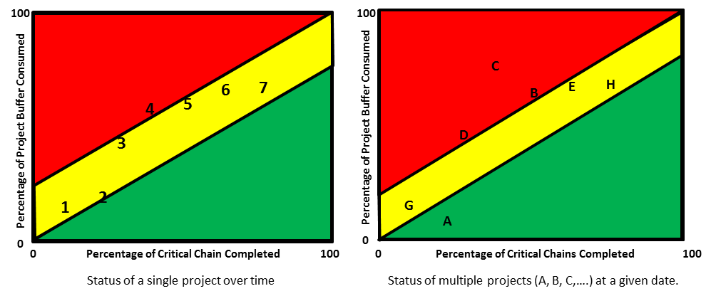

### состояние буфера (buffer status)

**состояние буфера (buffer status)** -

1. В случае изготовления на заказ в режиме "барабан-буфер-канат", упрощенного "барабан-буфер-канат" и цепочки поставок - мера отношения между временем, доступным для выполнения заказа, и стандартным производством.

время выполнения заказа, определяемое следующим образом:

состояние буфера (%) = (доступное время) / (стандартное время выполнения заказа) x 100%

Использование: Состояние буфера используется для определения необходимости экспедирования заказа. Хотя нет фиксированных процентов для трех областей буфера, много раз *(обычно)* буфер делится на три равные области. В этом случае, если состояние буфера для рабочего задания находится в диапазоне от 67 до 100%, заказу назначается зеленый цвет, указывающий на то, что выполняется нормальный процесс, поэтому никаких действий не требуется. Если состояние буфера составляет от 33 до 67%, назначается желтый цвет, который указывает на то, что прогресс меньше, чем обычно, поэтому следует разработать планы по ускорению выполнения заказа.

Если состояние буфера составляет от 0 до 33%, назначается красный цвет, что указывает на то, что заказ отстает от графика, поэтому планы ускорения должны быть выполнены немедленно.

Иллюстрация: буфер времени для рабочего задания показан ниже. Состояние буфера составляет примерно 20%, поэтому заказ в красной зоне.

2. При производстве для наличия - показатель уровня запасов готовой продукции (сырья и незавершенного производства) детали по сравнению с целевым уровнем буфера.

Использование: когда готовая продукция содержит две трети или более целевого уровня, статус буфера становится зеленым; от одной трети до двух третей статус желтый; а между нулем и одной третью он зеленый. Обычно используются ограничения в одну треть и две трети, но также используются и другие ограничения.

Иллюстрация: буфер запаса для артикула показан ниже. Состояние буфера детали желтое.

3. В производстве для наличия - мера приоритета заказа на работу.

Использование: Состояние буфера незавершенного рабочего задания основано на количестве единиц, указанном в процентах от целевого уровня, которые находятся ниже по потоку от рабочего задания.

Пример: если целевой уровень для детали составляет 600 единиц, и есть 150 единиц готовой продукции и 100 единиц в процессе после заказа 123, то заказ 123 имеет статус буфера (150 + 100) / 600 X 100% = 41,67. %, что обычно считается желтой областью.

4. В критической цепочке - мера израсходованного буфера проекта по отношению к завершенной части критической цепочки.

Использование: Статус буфера проекта должен быть скорректирован в соответствии с объемом завершенной критической цепочки. Цвет, связанный со статусом буфера, определяется степенью проникновения буфера в

отношение к прогрессу проекта, выраженное количеством завершенных критических цепочек. Наклоны зеленой и желтой зон определяются пользователем.

Диаграммы лихорадки полезны для индикации состояния буфера как в однопроектных, так и в многопроектных средах. В среде с одним проектом статус проекта отображается периодически (например, еженедельно), чтобы показать относительный статус проекта по отношению к оставшейся защите. Если проект находится в красной отметке в начале проекта, тогда менеджер проекта может захотеть принять немедленные меры, чтобы вернуть его в желтый или зеленый статус, прежде чем его / ее действия станут ограниченными. В среде с несколькими проектами менеджер программы может использовать диаграмму лихорадки нескольких проектов, чтобы определить, какие проекты испытывают проблемы (красная область) с точки зрения оставшейся буферной защиты, и распределить ресурсы между проектами, чтобы вернуть проблемные проекты в желтый или зеленую зону.

См. график температур.

#производство

#ббк

#дистрибуция

#ccpm

*Примечание АВ: (практикум 27.08.2021)*

*В CCPM - буфер - функция времени. ТОЛЬКО! остальное это влияет косвенно.CCPM - решение для выполнения проектов срок. если срок не важен, то CPCM не поможет.*

#translated
