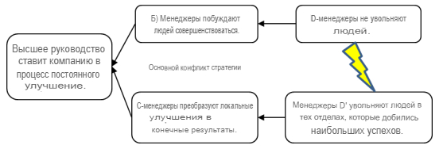

### стратегия облака основного конфликта (strategy core conflict cloud)

**стратегия облака основного конфликта (strategy core conflict cloud)** -  Основная проблема высшего руководства заключается в том, как разработать стратегию, чтобы привести компанию к процессу постоянного улучшения (POOGI).

Успешная стратегия должна соответствовать трем необходимым условиям:

1. Делать деньги сейчас и в будущем.

2. Обеспечьте безопасную и комфортную среду для сотрудников сейчас и в будущем.

3. Обеспечить удовлетворение рынка сейчас и в будущем.

Высшее руководство должно определить и внедрить стратегию, обеспечивающую выполнение всех трех необходимых условий. Посмотрите на облако ниже. Обратите внимание, что

-   [цель А гарантирует, что компания достигнет необходимого условия 1 (деньги сейчас и в будущем); ]{.c1}

```{=html}
<!-- -->
```
-   [сторона BD относится к необходимому условию 2 (безопасная и удовлетворяющая среда для работников сейчас и в будущем; ]{.c1}
-   [а требование C относится к необходимому условию 3 (обеспечивают удовлетворение рынка сейчас и в будущем). ]{.c1}

Конфликт возникает в том, что для достижения требования B Менеджеры не должны увольнять рабочих, но для достижения итоговых результатов менеджеры должны увольнять рабочих.


на рисунке:

-   [А - Высшее руководство ставит компанию на процесс непрерывного улучшения]{.c1}
-   [B - Управленцы побуждают людей улучшать]{.c1}
-   [C - Управленцы превращают локальные улучшения в итоговые (финансовые) результаты ]{.c1}
-   [D - Управленцы не увольняют рабочих]{.c1}
-   D' - Управленцы увольняют в отделах которые достигли наибольшего прогресса. [(потому что экономичность)]{.c0}
-   [CD' - Существует внешний предел пропускной способности отдела.]{.c1}

Одно из решений TOC основано на признании предположения, лежащего в основе CD': "Существует внешний предел пропускной способности (что приводит к тому, что основное внимание уделяется увольнению людей)". POOGI должен сосредоточиться на постоянном росте рынка, инициируя улучшения, которые обеспечивают истинные преимущества для клиентов, т.е.. решать проблемы клиентов. Эта стратегия обеспечивает выполнение трех необходимых условий, предоставляя компании конкурентное преимущество при принятии решений.



См.: [[решающее конкурентное преимущество]], [[дерево стратегии и тактики]].

#дст

#мп

*Примечание ЕА, ИА:  Повышение продуктивности подразделения приводит к тому что подразделение выполняет ту же работу меньшим количеством сотрудников. То есть текущие сотрудники МОГУТ делать больше работы, однако больший объем работы  не нужен. Значит нам надо лишних сократить.*

*Больший объем работы  не нужен - достигли внешнего предела пропускной способности: "Мы не можем больше продавать".*

*Примечание ИА: Для достижения цели "Делать деньги сейчас и в будущем." при невозможности расширяться  приводит к поиску решений на основе сокращения затрат. Вывод:  капиталистический бизнес может быть человечным только при расширении, если он не расширяется, то он начинает становиться "бесчеловечным" и резать затраты.*

*Примечание ИА: Когда есть ограничение рынка, всё что ты делаешь внутри компании является локальным. Поэтому здесь фокус на локальных улучшениях.*

*Применение АВ (ДЕ, Практикум 26.08.2022): Это конфликт с вовлечением людей в процесс улучшений. НЕЛЬЗЯ увольнять людей если вы хотите чтобы они помогали вам улучшать. В РФ принято совмещение, потом что  следствие КПСС, НОТ, Ударной труд, бригадная ответственность за результат. То что на ЗАпаде революция, а у нас это факт. У нас не хватает структуры. После улучшений отдела  ограничение двинется в рынок.*

Синоним: [[strategy core conflict cloud]].

#translated
