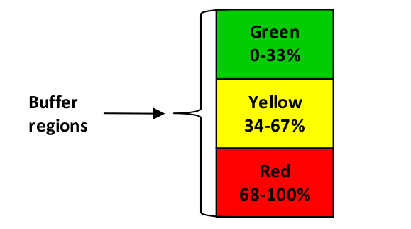

### сущность (entity)

**сущность (entity)** - утверждение, обычно в прямоугольнике или прямоугольнике с закругленными углами, которое описывает часть изучаемой системы с помощью диаграммы мыслительных процессов.

Использование: эффекты, причины, действия, условия, инъекции, промежуточные цели и препятствия - все это считается сущностями. Сущность должна быть изложена как полное предложение; однако утверждение не должно быть составным или сложным предложением и не должно содержать причинно-следственных связей.

Иллюстрация: фраза 20 "Автомобильный аккумулятор» не является допустимой. Тем не менее, 20 "Автомобильный аккумулятор разряжен", это действительная сущность, потому что это полное предложение.

См.: [[причина]], [[следствие]], [[инъекция]], [[промежуточная цель]], [[препятствие]], [[мыслительные процессы]].

#мп

*Примечание АВ: тут даётся определение "действительности" причины обсуждаемое в термине "посылка" (assumption).*

См.: *[[посылка]]*.

#translated
