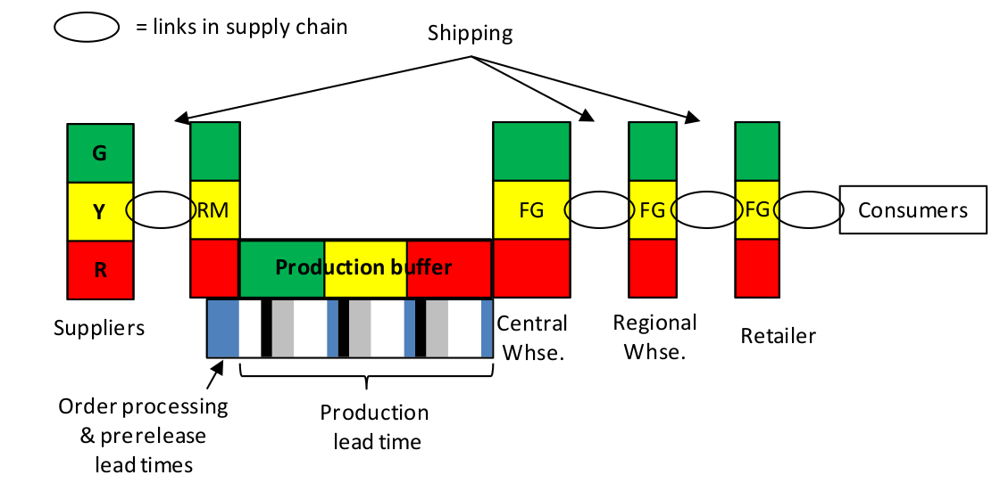

### теория ограничений философия управления цепями поставок (theory of constraints supply chain management philosophy)

**теория ограничений философия управления цепями поставок (theory of constraints supply chain management philosophy)** - Целостная философия цепи поставок, использующая метод вытягивания, который включает в себя установление размеров буфера запасов, а затем мониторинг и пополнение запасов в цепи поставок на **основе фактического потребления** конечного пользователя, а не прогноза.

Каждое звено в цепи поставок обеспечивает максимальный ожидаемый спрос в течение среднего времени пополнения, учитываемого уровнем ненадежности во времени пополнения. Каждое звено обычно получает то, что было отгружено или продано, хотя эта сумма корректируется в большую или меньшую сторону, когда управление буфером обнаруживает изменения в структуре спроса. Поставки обычно происходят часто и пополняют все товары до соответствующего уровня буфера.

Иллюстрация: На приведенной ниже диаграмме звенья в цепочке поставок представлены эллипсами:

Примечание АВ (перевод картинки):

-   [Поставщики ]{.c0}
-   [RM]{.c0}
-   [Производственный буфер: Обработка заказов и сроки подготовки к выпуску + Время выполнения заказа на производстве]{.c0}
-   [Центральный  склад]{.c0}
-   [Региональный склад]{.c0}
-   [Ритейлер]{.c0}
-   [Потребители]{.c0}

См.: [[решение для распределения/пополнения запасов]], [[философия управления бережливым производством]], [[философия управления бережливыми цепочками поставок]], [[философия производства теории ограничений]], [[традиционная философия управления цепочками поставок]].

Синоним: [[theory of constraints supply chain management philosophy]].

#translated
