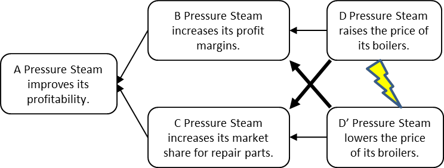

### угроза (jeopardy)

**угроза (jeopardy)** - две из четырех проверок, которые выполняются для проверки достоверности испаряющегося облака (ЕС).

Первая проверка заключается в том, ставит ли сущность D под угрозу требование, указанное в сущности C,

а вторая - не подвергает ли сущность D\' риску требование, установленное в сущности B.

Использование: Если между объектами нет постановки под угрозу, то формулировку в одном или обоих объектах необходимо изменить.

Перспектива: действительное испаряющееся облако (ИО) должно также соответствовать следующим двум условиям:

1. объекты D и D \'должны находиться в конфликте друг с другом;

2. объекты B и C не должны конфликтовать друг с другом, и оба должны быть обязательны для достижения цели A.

Иллюстрация:

Ставит ли D "Повышение цены на паровые котлы высокого давления" под угрозу существование С "Повышение рынка рынка запасных частей"? Ответ - да, потому что повышение цен на котлы приведет к сокращению продаж котлов, а сокращение продаж означает, что меньше котлов будет использоваться, для чего могут потребоваться запасные части.

Ставит ли D' "Снижение цены на паровые котлы высокого давления" существование B "Увеличение маржи продуктовой линейки"? Ответ - да, потому что, если предположить, что затраты не уменьшились, маржа снизится при снижении цены. (Ссылка: It\'s Not Luck, Goldratt, 1994,  Русск. издание "Цель-2. Дело не в везении" ).

См.: [[сущность]], [[испаряющееся облако]], [[требование]].

#мп

Синоним: [[jeopardy]].

#translated
