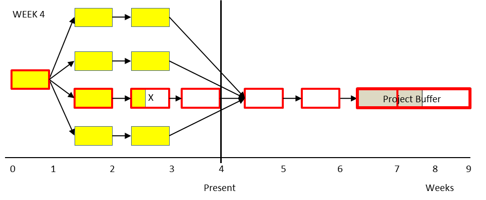

### уровень потребления буфера проекта (project buffer consumption rate)

**уровень потребления буфера проекта (project buffer consumption rate)** - (PBCR) - показатель прогресса проекта за последний отчетный период. Третья мера из набора трех мер в управлении буфером для управления проектами критической цепи с одним и несколькими проектами. Скорость потребления буфера проекта =

Увеличение % буфера, использованного за этот отчетный период\_\_\_

Увеличение % критической цепи, завершенной за этот отчетный период

Использование: первые два показателя управления проектом критической цепи, завершение критической цепи (%) и скорость сжигания буфера, являются общими показателями проекта на сегодняшний день. PBCR, третья мера, предоставляет информацию о ходе проекта за последний отчетный период. PBCR сообщает менеджеру проекта, был ли прогресс в критической цепочке за последний отчетный период адекватным по отношению к объему потребленного буфера проекта. PBCR сообщает менеджеру, возникли ли проблемы в критических цепочках в течение периода и были ли эффективными какие-либо корректирующие действия, предпринятые в начале периода (на основе PBCR предыдущего периода).

Пример. В приведенной ниже сети проектов проект содержит 12 задач по одной неделе каждая. Заштрихованные задачи уже выполнены. Незаштрихованные задачи не выполнены. Жирный контур указывает на задачи в критической цепочке, а X указывает на ресурс, который застрял на особенно сложной задаче. В конце недели 3 первые две меры для этого проекта являются завершенными по критической цепи, что составляет 33% (две недели критической цепи из шести недель были завершены); и скорость сжигания буфера, равная 1 (израсходована треть буфера проекта и завершена одна треть критической цепочки).

В конце 4-й недели (рисунок ниже), следующего отчетного периода, у ресурса критической цепи все еще были проблемы с задачей X, и он выполнил только два дня выполнения пятидневной задачи критической цепи. Несмотря на то, что в критической цепочке было достигнуто два дня прогресса, по календарю прошло пять дней, поэтому проект проник в буфер проекта еще на три дня. PBCR для 4-й недели равен 3,0 и рассчитывается следующим образом: три дня представляют собой 20-процентное увеличение буфера (3 дня/15 дней общего буфера проекта), а два дня прогресса в критической цепи представляют собой 6,67 % критической цепи (2 дней/30 дней). Тогда PBCR составляет 20/6,67 = 3,0. PBCR показывает, что в последний отчетный период проект потреблял буфер проекта быстрее, чем завершалась критическая цепочка. Значения PBCR выше 1,0, как в этом примере, указывают на то, что руководителю проекта необходимо уделить внимание или ресурсы деятельности критической цепи, вызывающей повышенный PBCR. Если буфер проекта расходуется с той же скоростью, с которой завершается критическая цепочка, PBCR будет равен 1,0. Значения PBCR менее 1,0 указывают на то, что критическая цепочка завершается быстрее, чем расходуется буфер проекта, а нулевое значение PBCR за период указывает на то, что задачи критической цепочки были выполнены в первоначально оцененное время. Отрицательные значения появляются в периоды, когда буфер проекта восстанавливается. (Обратите внимание, однако, что отрицательные значения PBCR также могут возникать в периоды, когда оставшаяся продолжительность критической цепи увеличивается из-за изменений в оценках времени выполнения задачи.)

См.: [[скорость сжигания буфера]], [[завершение критической цепи (%)]], [[меры по управлению проектом]].

Синоним: [[project buffer consumption rate]].

#translated
