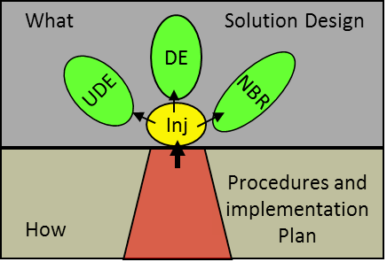

### цветок инъекции (injection flower)

**цветок инъекции (injection flower)** - Структурированное графическое представление областей, которые должны быть изучены, проверены и разработаны TOC-реализатором *(TOC implementer)* для обеспечения успешной реализации инъекции.

Верхняя часть цветка инъекции содержит дизайн решения («Что?» - соответствующие знания для инъекции),

нижняя часть представляет механику («Как» - практические аспекты инъекции, описывающие способ интеграции инъекции в реальность, а также способы ее реализации).

Использование: для каждой инъекции группа реализации должна изучить ее сущность и структуру, а также убедиться, что инъекция устраняет соответствующие нежелательные эффекты, вызывает желаемые эффекты и не вызывает каких-либо значительных оговорок отрицательных ветвей. Для каждой инъекции команда составляет план внедрения и разрабатывает процедуры.

Роль ТОС-ведущего заключается в том, чтобы поощрять и поддерживать команду внедрения в выполнении этой работы.

См.: [[последовательность вопросов Изменения]], [[процесс отсечения негативных ветвей]].

#мп

Синоним: [[injection flower]].

#translated
